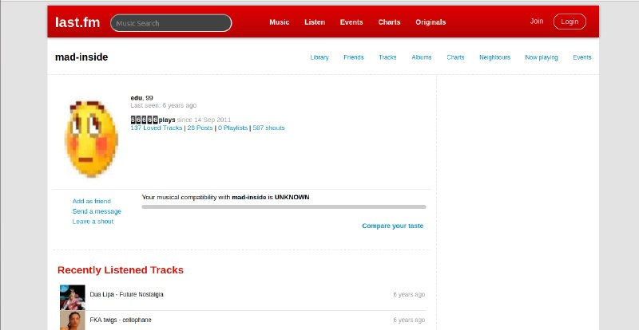
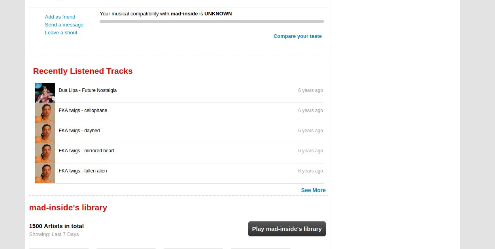
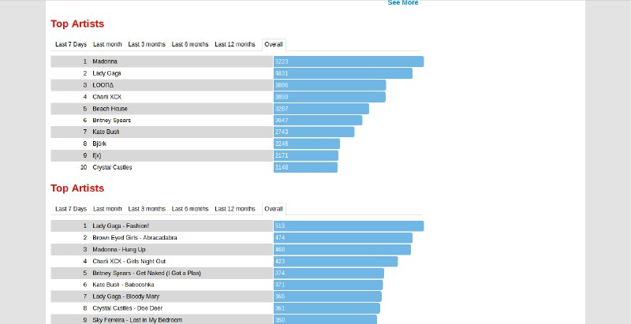
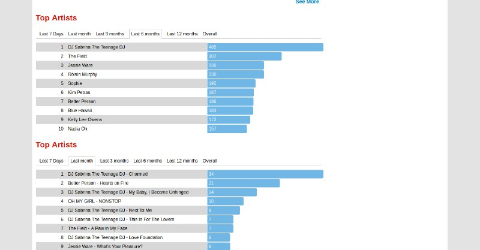
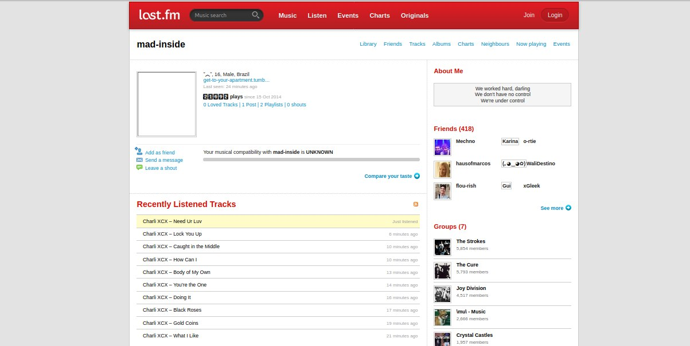
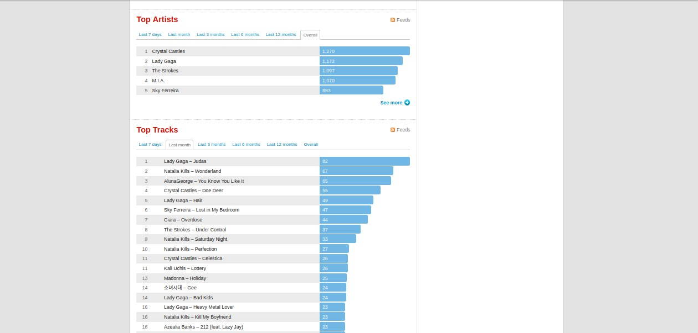

<h1 align="center">Clone do Last.fm antigo.</h1>

<p align="center">O last.fm é um site que cataloga seu histórico de audições em players e serviços de streaming, transformando-o em tabelas e recomendações. Em 2015 o site mudou sua interface, deixando a grande maioria dos usuários insatisfeitos e uma nostalgia em relação a essa antiga interface foi sendo alimentada de lá pra cá. Pensando nisso, para exercitar meus conhecimentos em desenvolvimento front-end resolvi fazer uma réplica simples do layout pré-2015 do last.fm utilizando os dados da api do próprio last.fm.</p>

<h5 align="center">Em construção.</h5>

<h2 align="center">Como testar.</h2>

<p align="center">É necessário instalar as ferramentas <a href='https://git-scm.com'>Git</a>, <a href='https://nodejs.org/'>Node.js</a> e <a href='https://pt-br.reactjs.org/'>ReactJs</a>. Também utilize o gerencionar de pacotes de sua preferência: NPM (já vem com o Node) e <a href='https://classic.yarnpkg.com/pt-BR/docs/install/'>Yarn </a>.</p>

1. Clone o projeto no repositório de preferência: 
```bash
git clone <https://github.com/diegofreitas11/clone-lastfm-antigo.git>
```

2. Acesse a pasta do projeto:
```bash
cd clone-lastfm-antigo
```

3. Rode o projeto em desenvolvimento:
```bash
yarn start
```
ou
```bash
npm start
```

4. Acesse 'localhost:3000/' no navegador. A url sem nada, redireciona os dados do meu perfil do last.fm, qualquer username que for colocado após a barra os dados respectivos serão buscados (a api do last.fm não retorna corretamente alguns dados básicos como idade). Alguns exemplos de username para testar: fltngboy, mariacarol_, mad-inside, siamesedrearn.

<h2 align="center">Alguns prints.</h2>

Alguns prints do que foi até agora. (Ressaltando que os dados são buscados do last.fm atual).





Os charts de período diferentes são buscados dinamicamente.





Prints do last fm antigo capturado pelo <a href='http://web.archive.org'>Web Archive</a>.






